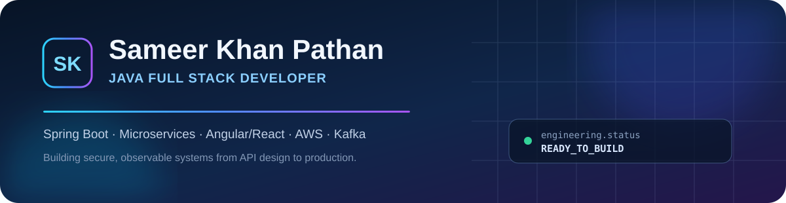

<p align="center">
  
</p>

<p align="center">
  <a href="https://www.linkedin.com/in/sameer-khan-a2525041a"></a>
  <a href="https://sameer-khan-pathan.patsameer26.chatgpt.site"></a>
  
</p>

## 👋 About me

I’m a **Java Full Stack Developer** with 5+ years of experience building reliable enterprise applications—from Spring Boot services and event-driven workflows to modern Angular/React interfaces and cloud delivery on AWS.

I care about the parts of engineering that make software dependable in the real world: clean API contracts, resilient distributed systems, database performance, secure delivery, observability, and thoughtful incident resolution.

- 🔭 Building production-minded full-stack and backend portfolio projects
- ⚙️ Strongest in Java, Spring Boot, microservices, REST APIs, and distributed systems
- ☁️ Experienced with AWS, Docker, Kubernetes, Terraform, and CI/CD
- 🤝 Open to Java full-stack and backend engineering opportunities in the United States

## 🧰 Technology stack

<p align="center">
  
  
  
  
  
  
  
  
  
  
  
  
  
  
  
</p>

## 🚀 Featured projects

| Project | Engineering highlights | Stack |
|---|---|---|
| **[RetailFlow Platform](https://github.com/sameerkhan63731/retailflow-platform)** | Idempotent checkout, validation, order events, reliable API design | Java 17 · Spring Boot · REST · Docker |
| **[CustomerHub Portal](https://github.com/sameerkhan63731/customerhub-portal)** | Customer search, support workflows, reporting, operational health | Java 17 · Spring Boot · Actuator |
| **[EventPulse Notifications](https://github.com/sameerkhan63731/eventpulse-notifications)** | Event deduplication, retry policies, dead-letter handling, delivery state | Spring Boot · Kafka · Redis |
| **[CloudOps Spring Starter](https://github.com/sameerkhan63731/cloudops-spring-starter)** | Health probes, metrics, secure containers, Kubernetes-ready delivery | Spring Boot · Prometheus · Docker · Kubernetes |

> These are independent portfolio implementations built from general engineering patterns. They contain no employer source code, confidential data, or proprietary architecture.

## 🧠 Engineering principles

```text
Design       Clear service boundaries · Explicit API contracts · Practical patterns
Reliability  Idempotency · Failure handling · Observability · Production readiness
Quality      Automated tests · Code review · Repeatable delivery · Useful documentation
Operations   Trace problems across UI · APIs · Messaging · Databases · Cloud
```

## 📚 Currently exploring

- Transactional outbox patterns and reliable event delivery
- OpenTelemetry tracing across Spring-based services
- Kubernetes autoscaling and progressive delivery
- Practical AI-assisted engineering with careful human review

## 🏅 Credentials

- AWS Certified Developer – Associate
- Java Full Stack Developer Certification

---

<p align="center">
  <b>Build clearly. Deliver reliably. Keep improving.</b><br />
  <sub>Available for Java full-stack and backend software engineering opportunities.</sub>
</p>
